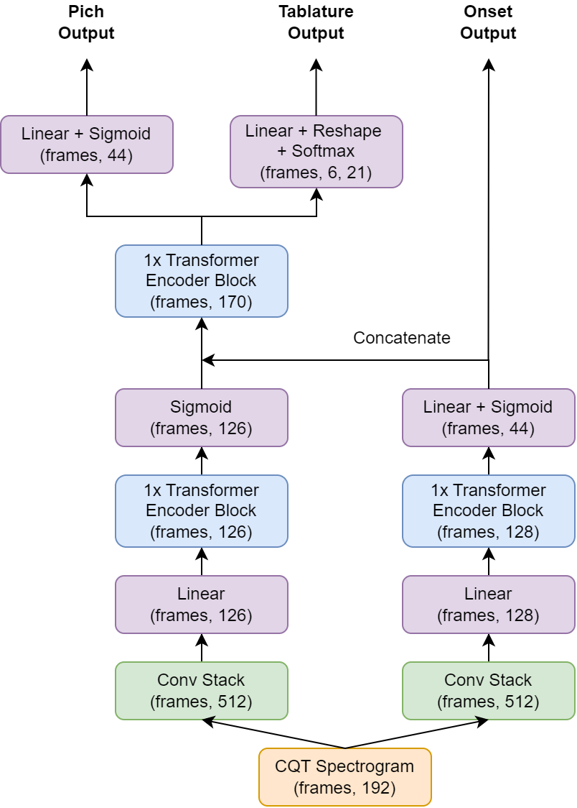

<!-- # End-to-End Automated Guitar Transcription with Deep Learning
## subtitle -->

<!-- This is the demo page for the practical machine learning course at the University of Tübingen. The  **End-to-End Automated Guitar Transcription with Deep Learning** -->

## Abstract
We propose an end-to-end automated guitar transcription method that generates a human-readable transcription from guitar sound to tablature notation. We incorporate knowledge from guitar transcription models of the previous years and address their issues. Most previous work on tablature transcription doesn't tackle onset estimation. The main contribution of this paper is the conjunction of frame-level tablature estimation and true onset estimation, enabling the generation of MIDI files and tablature. We employ a multi-task learning setup, in which frame-level tablature estimation and frame-level onset estimation are performed simultaneously. The model architecture consists of a tablature and an onset stack, that both contain convolutional layers, transformer blocks, and feedforward networks. We train and evaluate our method on GuitarSet. We demonstrate that our method is competitive with baseline tablature transcription models, while achieving a high onset estimation performance.

### Model Architecture
The model learns to predict the onsets, pitches, and tablature from a raw guitar audio. The model architecture is depicted in the figure below, where the output shape of each component is denoted in brackets. First, the model input is generated by transforming a raw guitar audio into its constant-Q transform (CQT) spectrogram representation. The continuous audio signal is discretized into a high resolution format called frames, such that each audio second consists of approximately 43 frames. Subsequently, the CQT is processed by a convolutional network, a feedforward linear layer, a transformer encoder block, and a linear sigmoid layer, leading to a probability distribution over onset and pitch predictions. Importantly, the output of the onset stack and the tablature stack are concatenated, and finally processed by a transformer encoder to predict the tablature and pitches corresponding to the input.\
<!--  -->

### Transcriptions for GuitarSet
The model is trained on GuitarSet, which contains 360 recordings of real acoustic guitars with high quality annotations. The examples below show transcriptions of GuitarSet pieces that the model was not trained on.   

|Source|Proposed model|
|<audio src="transcription_samples/GuitarSet/03_Jazz2-110-Bb_comp_mic/03_Jazz2-110-Bb_comp_mic.wav" controls="" preload=""></audio>|<audio src="transcription_samples/GuitarSet/03_Jazz2-110-Bb_comp_mic/03_Jazz2-110-Bb_comp_mic_prediction.wav" controls="" preload=""></audio>|
|<audio src="transcription_samples/GuitarSet/03_SS1-68-E_comp_mic/03_SS1-68-E_comp_mic.wav" controls="" preload=""></audio>|<audio src="transcription_samples/GuitarSet/03_SS1-68-E_comp_mic/03_SS1-68-E_comp_mic_prediction.wav" controls="" preload=""></audio>|
|<audio src="transcription_samples/GuitarSet/03_SS2-107-Ab_solo_mic/03_SS2-107-Ab_solo_mic.wav" controls="" preload=""></audio>|<audio src="transcription_samples/GuitarSet/03_SS2-107-Ab_solo_mic/03_SS2-107-Ab_solo_mic_prediction.wav" controls="" preload=""></audio>|
|<audio src="transcription_samples/GuitarSet/04_BN2-166-Ab_comp_mic/04_BN2-166-Ab_comp_mic.wav" controls="" preload=""></audio>|<audio src="transcription_samples/GuitarSet/04_BN2-166-Ab_comp_mic/04_BN2-166-Ab_comp_mic_prediction.wav" controls="" preload=""></audio>|
|<audio src="transcription_samples/GuitarSet/05_Jazz3-137-Eb_comp_mic/05_Jazz3-137-Eb_comp_mic.wav" controls="" preload=""></audio>|<audio src="transcription_samples/GuitarSet/05_Jazz3-137-Eb_comp_mic/05_Jazz3-137-Eb_comp_mic_prediction.wav" controls="" preload=""></audio>|
|<audio src="transcription_samples/GuitarSet/05_Jazz3-137-Eb_solo_mic/05_Jazz3-137-Eb_solo_mic.wav" controls="" preload=""></audio>|<audio src="transcription_samples/GuitarSet/05_Jazz3-137-Eb_solo_mic/05_Jazz3-137-Eb_solo_mic_prediction.wav" controls="" preload=""></audio>|
|<audio src="transcription_samples/GuitarSet/05_Rock1-130-A_comp_mic/05_Rock1-130-A_comp_mic.wav" controls="" preload=""></audio>|<audio src="transcription_samples/GuitarSet/05_Rock1-130-A_comp_mic/05_Rock1-130-A_comp_mic_prediction.wav" controls="" preload=""></audio>|
|<audio src="transcription_samples/GuitarSet/05_Rock1-130-A_solo_mic/05_Rock1-130-A_solo_mic.wav" controls="" preload=""></audio>|<audio src="transcription_samples/GuitarSet/05_Rock1-130-A_solo_mic/05_Rock1-130-A_solo_mic_prediction.wav" controls="" preload=""></audio>|

### Transcriptions for phone recordings
The examples below show transcriptions of our model of guitar audio recorded on a phone. In general, the transcription quality is worse compared to GuitarSet. This might be due to the differences of the recording setup and lower data quality. However, the transcriptions could serve as initial transcription that can be refined by the user.   

|Source|Proposed model|
|<audio src="transcription_samples/phone_recordings/Acg/Acg.wav" controls="" preload=""></audio>|<audio src="transcription_samples/phone_recordings/Acg/Acg_prediction.wav" controls="" preload=""></audio>|
|<audio src="transcription_samples/phone_recordings/Am/Am.wav" controls="" preload=""></audio>|<audio src="transcription_samples/phone_recordings/Am/Am_prediction.wav" controls="" preload=""></audio>|
|<audio src="transcription_samples/phone_recordings/Dangerously/Dangerously.wav" controls="" preload=""></audio>|<audio src="transcription_samples/phone_recordings/Dangerously/Dangerously_prediction.wav" controls="" preload=""></audio>|
|<audio src="transcription_samples/phone_recordings/Ignite/Ignite.wav" controls="" preload=""></audio>|<audio src="transcription_samples/phone_recordings/Ignite/Ignite_prediction.wav" controls="" preload=""></audio>|
|<audio src="transcription_samples/phone_recordings/Solo1/Solo1.wav" controls="" preload=""></audio>|<audio src="transcription_samples/phone_recordings/Solo1/Solo1_prediction.wav" controls="" preload=""></audio>|
|<audio src="transcription_samples/phone_recordings/Solo2_1/Solo2_1.wav" controls="" preload=""></audio>|<audio src="transcription_samples/phone_recordings/Solo2_1/Solo2_1_prediction.wav" controls="" preload=""></audio>|
|<audio src="transcription_samples/phone_recordings/Sungha_jung_1/Sungha_jung_1.wav" controls="" preload=""></audio>|<audio src="transcription_samples/phone_recordings/Sungha_jung_1/Sungha_jung_1_prediction.wav" controls="" preload=""></audio>|
|<audio src="transcription_samples/phone_recordings/ThousandYears/ThousandYears.wav" controls="" preload=""></audio>|<audio src="transcription_samples/phone_recordings/ThousandYears/ThousandYears_prediction.wav" controls="" preload=""></audio>|

<!-- ### Training Data Sample
Audio are sampled from training split with different timbre in each column. -->

<!-- |   |DI|Marshall|Fender-twins|Mesa|
|1.|<audio src="Guitar_Transcription_sample/Training/0701_3_c_DI.wav" controls="" preload=""></audio>|<audio src="Guitar_Transcription_sample/Training/0701_3_c_marshall.wav" controls="" preload=""></audio>|<audio src="Guitar_Transcription_sample/Training/0701_3_c_ft.wav" controls="" preload=""></audio>|<audio src="Guitar_Transcription_sample/Training/0701_3_c_mesa.wav" controls="" preload=""></audio>|
|2.|<audio src="Guitar_Transcription_sample/Training/0503_1_a_DI.wav" controls="" preload=""></audio>|<audio src="Guitar_Transcription_sample/Training/0503_1_a_marshall.wav" controls="" preload=""></audio>|<audio src="Guitar_Transcription_sample/Training/0503_1_a_ft.wav" controls="" preload=""></audio>|<audio src="Guitar_Transcription_sample/Training/0503_1_a_mesa.wav" controls="" preload=""></audio>|

### Realistic Data Transcription

|Source|Proposed model|
|<audio src="Guitar_Transcription_sample/RealData/clip1.wav" controls="" preload=""></audio>|<audio src="Guitar_Transcription_sample/RealDataTranscription/clip1.wav" controls="" preload=""></audio>|
|<audio src="Guitar_Transcription_sample/RealData/clip2.wav" controls="" preload=""></audio>|<audio src="Guitar_Transcription_sample/RealDataTranscription/clip2.wav" controls="" preload=""></audio>|
|<audio src="Guitar_Transcription_sample/RealData/clip3.wav" controls="" preload=""></audio>|<audio src="Guitar_Transcription_sample/RealDataTranscription/clip3.wav" controls="" preload=""></audio>|
|<audio src="Guitar_Transcription_sample/RealData/clip4.wav" controls="" preload=""></audio>|<audio src="Guitar_Transcription_sample/RealDataTranscription/clip4.wav" controls="" preload=""></audio>|
|<audio src="Guitar_Transcription_sample/RealData/clip5.wav" controls="" preload=""></audio>|<audio src="Guitar_Transcription_sample/RealDataTranscription/clip5.wav" controls="" preload=""></audio>| -->

<!-- ### Dataset
<a href="https://drive.google.com/drive/folders/1ZEy5dytEDquxyf_WYDhKgadSCgPsq_tD?usp=sharing">Google Drive Link</a> -->

<!-- ### Contact
Yu-Hua Chen f08946011@ntu.edu.tw -->
